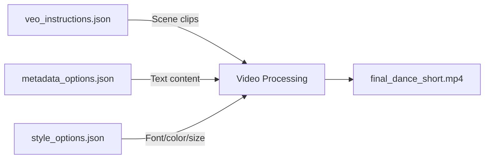

# Configuration Guide

## Overview

This guide provides comprehensive documentation for configuring **DanceShorts FX Automator** through its three JSON configuration files.

## Configuration Files

The system uses three separate configuration files:
1. **`veo_instructions.json`** - Scene sequencing and video clips
2. **`metadata_options.json`** - Text overlay content and social media metadata
3. **`style_options.json`** - Visual styling for text overlays

---

### 1. veo_instructions.json

Defines which video clips to use and how to sequence them.

#### Schema

```json
{
  "scenes": [
    {
      "id": <integer>,
      "source": "<string>",
      "start": <float>,
      "duration": <float>
    }
  ]
}
```

#### Field Reference

| Property | Type | Required | Description | Example |
|----------|------|----------|-------------|---------|
| `id` | integer | Yes | Unique scene identifier (determines order) | `1` |
| `source` | string | Yes | Path to source video file | `"clips/dance.mp4"` |
| `start` | float | Yes | Start timestamp in seconds | `2.5` |
| `duration` | float | Yes | Duration in seconds to extract | `5.0` |

#### Example

```json
{
  "scenes": [
    {
      "id": 1,
      "source": "clip1.mp4",
      "start": 0,
      "duration": 5
    },
    {
      "id": 2,
      "source": "clip2.mp4",
      "start": 0,
      "duration": 5
    }
  ]
}
```

---

### 2. metadata_options.json

**NEW SCHEMA**: Defines rich metadata including text overlays, titles, descriptions, and tags for each creative option.

#### Schema

```json
{
  "option_1": {
    "title": "<string>",
    "description": "<string>",
    "tags": ["<string>", ...],
    "emotional_hook": "<string>",
    "text_hook": "<string>",
    "text_overlay": ["<string>", ...]
  },
  "option_2": { ... },
  "option_3": { ... },
  "recommended": <integer>
}
```

#### Field Reference

| Property | Type | Required | Description |
|----------|------|----------|-------------|
| `option_N` | object | Yes | Creative option (N = 1, 2, 3, etc.) |
| `title` | string | Yes | Video title for social media |
| `description` | string | Yes | Full description with hashtags |
| `tags` | array | Yes | Array of searchable keywords |
| `emotional_hook` | string | Yes | Target emotional response |
| `text_hook` | string | Yes | Short engaging text for thumbnails |
| `text_overlay` | array | **Yes** | Array of text strings to display in video |
| `recommended` | integer | Yes | Which option to use (1, 2, 3, etc.) |

#### Text Overlay Timing

**Important**: The `text_overlay` array contains only text content. Timing is **auto-distributed** evenly across the video duration.

**Example**: For a 10-second video with 4 overlays:
- Overlay 1: 0.0s - 2.5s
- Overlay 2: 2.5s - 5.0s  
- Overlay 3: 5.0s - 7.5s
- Overlay 4: 7.5s - 10.0s

#### Example

```json
{
  "option_1": {
    "title": "Bachata: Amor del Bueno 📻❤️",
    "description": "Viaja en el tiempo a una época donde el amor se declaraba bailando frente al mar. 🌊\n\n#Bachata 📻 #Nostalgia 🕰️ #Años60 🌅",
    "tags": [
      "bachata",
      "bachata romantica",
      "amor",
      "nostalgia"
    ],
    "emotional_hook": "Nostalgia y calidez: Despierta el anhelo por un pasado romántico.",
    "text_hook": "Como se enamoraba antes... 🕰️",
    "text_overlay": [
      "Aquellos domingos de playa",
      "Cuando el tiempo se detenía",
      "Solo tú, yo y la bachata",
      "Amor eterno de los 60"
    ]
  },
  "option_2": {
    "title": "Elegancia en el Baile ✨💃",
    "description": "La clase nunca pasa de moda...",
    "tags": ["bachata dance", "elegancia"],
    "emotional_hook": "Aspiracional: Deseo de experimentar elegancia.",
    "text_hook": "¿Existe algo más elegante? ✨",
    "text_overlay": [
      "La elegancia es eterna",
      "Cada paso cuenta una historia",
      "Conexión pura y sutil",
      "El arte de la bachata fina"
    ]
  },
  "recommended": 1
}
```

---

### 3. style_options.json

**NEW FILE**: Defines visual styling for text overlays (fonts, colors, sizes).

#### Schema

```json
{
  "options": {
    "<option_id>": {
      "style": "<string>",
      "font": "<string>",
      "color": "<string>",
      "font_size": <integer>
    }
  },
  "default": "<option_id>"
}
```

#### Field Reference

| Property | Type | Required | Description | Default |
|----------|------|----------|-------------|---------|
| `style` | string | Yes | Display name for the style | - |
| `font` | string | Yes | Font family name | `"Arial"` |
| `color` | string | Yes | Text color (name or hex) | `"white"` |
| `font_size` | integer | Yes | Font size in pixels | `70` |
| `default` | string | Yes | Which option to use by default | `"2"` |

#### Available Fonts

The system supports standard system fonts. Common options:
- **Impact** - Bold, attention-grabbing
- **Arial** - Clean, minimal
- **Serif** - Elegant, classic

#### Example

```json
{
  "options": {
    "1": {
      "style": "Minimal",
      "font": "Arial",
      "color": "white",
      "font_size": 70
    },
    "2": {
      "style": "Recommended",
      "font": "Impact",
      "color": "yellow",
      "font_size": 70
    },
    "3": {
      "style": "Cinematic",
      "font": "Serif",
      "color": "white",
      "font_size": 60
    }
  },
  "default": "2"
}
```

---

## How It Works

The system combines all three configuration files:



1. **Scenes** from `veo_instructions.json` are stitched together
2. **Text overlays** from the recommended option in `metadata_options.json`
3. **Styled** using the default option from `style_options.json`
4. **Auto-distributed** timing ensures overlays appear evenly throughout the video

---

## Validation

Test your configuration before rendering:

```bash
python main.py --dry-run
```

This validates:
- ✅ All three JSON files exist
- ✅ JSON syntax is correct
- ✅ Required fields are present
- ✅ Recommended/default options exist

---

## Migration from Old Format

If you have an old `metadata_options.json` with style information:

**Old format** (deprecated):
```json
{
  "options": {
    "1": {"style": "Minimal", "font": "Arial"}
  }
}
```

**New format** (create two files):

`metadata_options.json`:
```json
{
  "option_1": {
    "title": "My Video",
    "text_overlay": ["Text 1", "Text 2"]
  },
  "recommended": 1
}
```

`style_options.json`:
```json
{
  "options": {
    "1": {"style": "Minimal", "font": "Arial", "color": "white", "font_size": 70}
  },
  "default": "1"
}
```

---

## Troubleshooting

### Common Errors

**Error:** `FileNotFoundError: style_options.json not found`
- **Fix:** Run the app once to auto-generate, or create manually

**Error:** `No text overlays found in selected metadata option`
- **Fix:** Ensure the recommended option has a non-empty `text_overlay` array

**Error:** `Recommended option X not found`
- **Fix:** Check that `option_X` exists (e.g., if `recommended: 2`, you need `option_2`)

---

## See Also

- [User Guide](user-guide.md) - Step-by-step usage
- [FAQ](faq.md) - Frequently asked questions
- [API Reference](api-reference.md) - Python API docs
