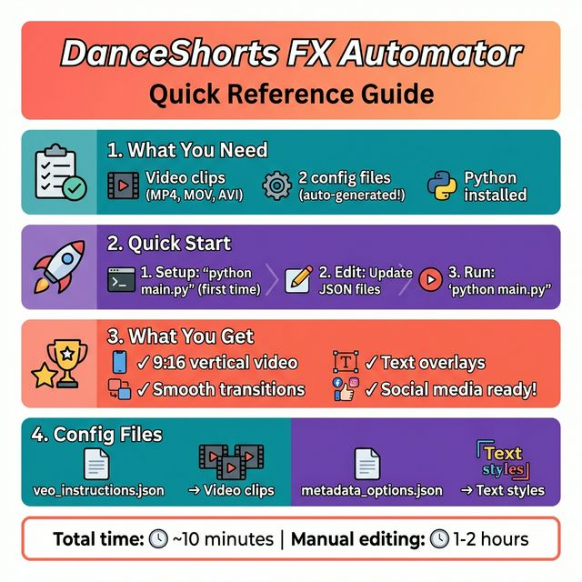
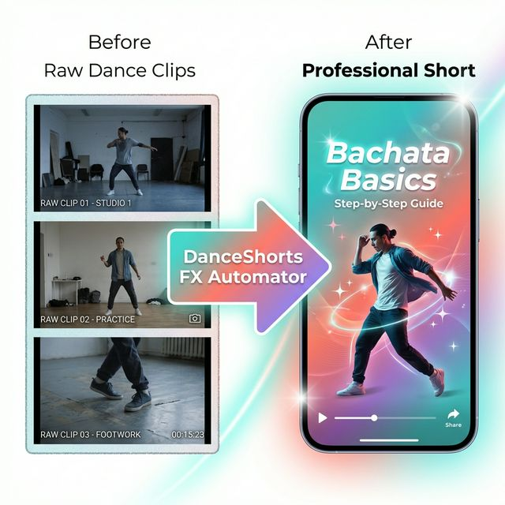
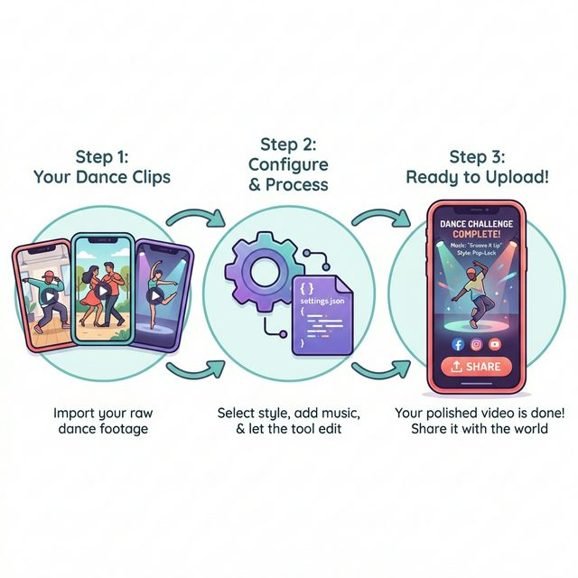
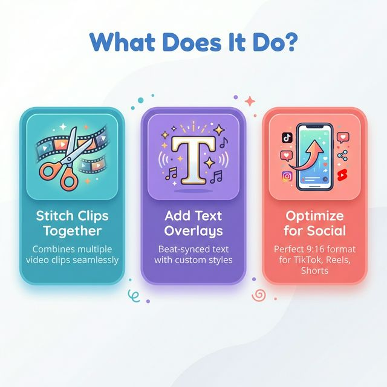
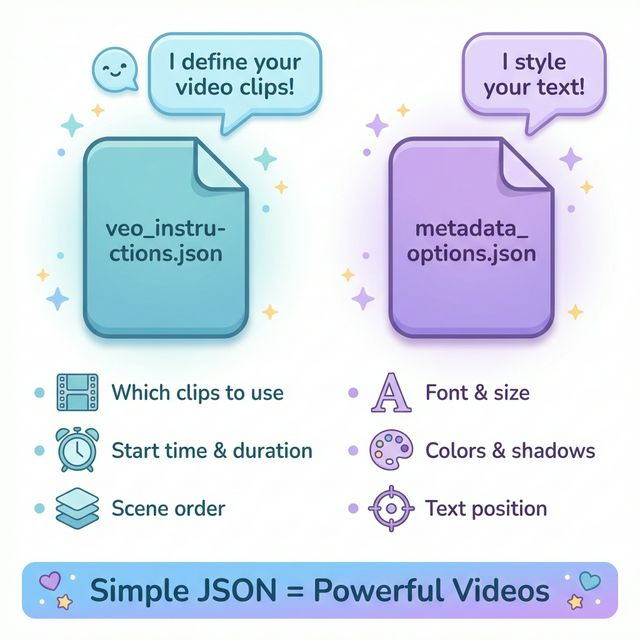

# DanceShorts FX Automator - Visual Guide

Welcome! This visual guide will help you understand exactly what the DanceShorts FX Automator does and how it works—no technical knowledge required.

## 🎯 What Problem Does This Solve?

Creating professional dance videos for social media (TikTok, Instagram Reels, YouTube Shorts) normally requires:
- Expensive video editing software
- Hours of manual editing
- Technical expertise

**DanceShorts FX Automator automates this entire process!**

---

## 📋 Quick Reference Card

> **Print this out!** This one-page reference card shows everything you need to know at a glance.

---

## 📱 Before & After: See the Transformation

**What you start with:** Raw, unpolished dance clips from your phone or camera

**What you get:** A professional-looking vertical video perfect for social media, complete with:
- Smooth transitions between clips
- Eye-catching text overlays
- Perfect 9:16 vertical format
- Ready to upload immediately!

---

## 🎬 How It Works: Simple 3-Step Process

### Step 1: Your Dance Clips
Just gather your raw dance footage—no editing needed! The tool accepts all common video formats (MP4, MOV, AVI, etc.)

### Step 2: Configure & Process
Tell the tool which clips to use and how you want them styled using simple configuration files. Then let the automation do its magic!

### Step 3: Ready to Upload!
Get a polished, professional video file ready to share with the world on your favorite social media platforms.

---

## ✨ What Does It Do?

### 1. Stitch Clips Together
Automatically combines multiple video clips into one seamless video with smooth cross-dissolve transitions.

### 2. Add Text Overlays
Applies beat-synced text overlays with customizable fonts, colors, and styles. Choose from three preset styles:
- **Minimal** - Clean and simple
- **Recommended** - Balanced and professional (default)
- **Cinematic** - Bold and dramatic

### 3. Optimize for Social
Exports your video in the perfect 9:16 vertical format that TikTok, Instagram Reels, and YouTube Shorts love!

---

## 📝 Understanding Configuration Files

The tool uses two simple JSON files to know what you want:

### `veo_instructions.json` - Defines Your Video Content
This file tells the tool:
- 📹 **Which clips to use** - List your video files
- ⏱️ **Start time & duration** - Which parts of each clip to include
- 📑 **Scene order** - How to arrange your clips

### `metadata_options.json` - Styles Your Text
This file controls the look and feel:
- 🔤 **Font & size** - Typography settings
- 🎨 **Colors & shadows** - Visual styling
- 📍 **Text position** - Where overlays appear

> **Pro Tip:** The tool can auto-generate sample configuration files for you! Just run it once and edit the examples.

---

## ⏱️ How Long Does It Take?

Here's a realistic timeline for creating a 30-second dance short:

| Task | Time Required |
|------|---------------|
| Prepare your video clips | ~5 minutes |
| Configure scenes & styles | ~3 minutes |
| Run the automator | ~2 minutes |
| **Total** | **~10 minutes** |

Compare this to 1-2 hours of manual editing in traditional video software!

---

## 🎓 Real-World Example

Let's say you want to create a 30-second Bachata tutorial:

### What You Have:
- `intro.mp4` - You introducing the move (5 seconds)
- `demo_slow.mp4` - Slow-motion demonstration (15 seconds)
- `demo_full.mp4` - Full-speed demonstration (8 seconds)
- `outro.mp4` - Your closing thoughts (5 seconds)

### What You Do:
1. Put all four video files in a folder
2. Create a simple `veo_instructions.json` that lists the clips
3. (Optional) Customize text styles in `metadata_options.json`
4. Run: `python main.py`

### What You Get:
✅ `final_dance_short.mp4` - A polished 33-second video with:
- All four clips stitched together smoothly
- "Bachata Basics" text overlay
- Perfect vertical format
- Ready to upload to TikTok, Instagram, or YouTube!

---

## 🚀 Getting Started

Ready to create your first video? Follow these quick links:

1. **[Installation Guide](getting-started.md)** - Set up the tool (one-time setup)
2. **[User Guide](user-guide.md)** - Step-by-step walkthrough
3. **[Configuration Guide](configuration.md)** - Customize your videos
4. **[FAQ](faq.md)** - Common questions answered

---

## 💡 Who Is This For?

This tool is perfect for:
- 💃 **Dance Instructors** - Create tutorial videos for students
- 🎵 **Choreographers** - Showcase routines professionally
- 📱 **Social Media Creators** - Automate your content pipeline
- 🏃 **Content Creators** - Produce consistent, polished videos quickly

---

## ❓ Frequently Asked Questions

### Do I need to know how to code?
**No!** While the tool runs using Python, you only need to:
- Install it once (following simple instructions)
- Edit two simple text files (we provide templates)
- Run one command: `python main.py`

### What if I don't understand JSON files?
No worries! The tool auto-generates example files for you. You just need to:
- Change file names to match your videos
- Adjust timing numbers
- (Optional) Change text and colors

### Can I use this for other types of videos?
Yes! While optimized for dance videos, it works great for:
- Fitness tutorials
- Cooking demonstrations
- Product showcases
- Any content that needs professional vertical video formatting

### How much does it cost?
The tool is **completely free and open-source**! The only requirements are:
- A computer (Mac, Windows, or Linux)
- Python installed (free)
- Your video clips

---

## 🆘 Need Help?

- **[FAQ](faq.md)** - Detailed troubleshooting
- **[Getting Started](getting-started.md)** - Installation help
- **[GitHub Issues](https://github.com/julesjewels-ai/danceshorts-fx-automator/issues)** - Report bugs or request features

---

## 🎉 Ready to Create?

**Next Step:** [Install the Tool →](getting-started.md)

Transform your raw dance clips into professional social media content in minutes, not hours!
